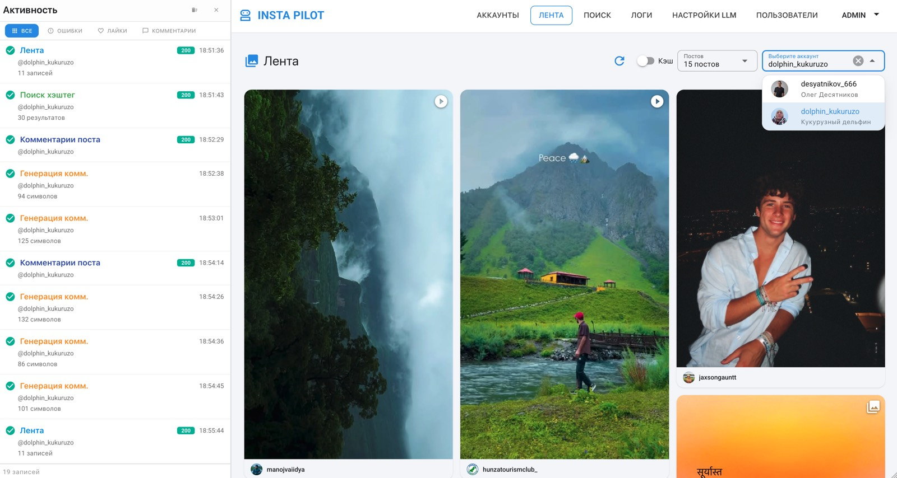

<div align="center">

# 🚀 InstaPilot

**Fullstack-сервис автоматизации Instagram-активности**<br>
с real-time мониторингом и генерацией комментариев через LLM

<sub>**Frontend**</sub>


<sub>**Backend**</sub>


<sub>**Real-time & Infrastructure**</sub>


</div>

---

<div align="center">

## 🎯 Что демонстрирует проект

✅ **Архитектурное мышление** — три сервиса на разных языках, чёткие границы ответственности
✅ **Real-time** — нативный Reverb вместо сторонних провайдеров, private-каналы, авторизация подписок
✅ **Async-flow** — Job + Service + LLM + WebSocket-прогресс в одной фиче
✅ **FSD на фронте** — масштабируемая архитектура с публичными API слайсов
✅ **Type safety end-to-end** — TypeScript на фронте, strict-types на бэке, Pydantic в Python
✅ **DevOps-готовность** — всё поднимается одной командой `docker compose up`

</div>

---

<div align="center">

### 🎬 Общий обзор


> _Вход в систему → выбор аккаунта → лента публикаций → генерация комментария через LLM_

</div>

---

## 📌 О проекте

`InstaPilot` — это MVP fullstack-приложения для управления несколькими Instagram-аккаунтами:
просмотр ленты, поиск по хэштегам и геолокации, лайки, комментарии и AI-генерация
персонализированных комментариев.

🎨 **Ключевая особенность генерации комментариев** — LLM анализирует **само изображение
поста**, а не только текстовое описание. Картинка скачивается из Instagram, отправляется
в multimodal-модель (`GLM-4V` / `GPT-4o`), которая «видит» содержимое кадра и возвращает
релевантный комментарий в выбранном пользователем тоне (`friendly` / `professional` /
`casual` / `humorous`). Это даёт персонализацию по реальному визуальному контенту,
а не шаблонную фразу.

Главная инженерная ценность проекта — **связка независимых сервисов на трёх языках** —
`JavaScript`, `TypeScript` и `PHP` — объединённых одной шиной событий и WebSocket-каналами
Reverb для мгновенной обратной связи в UI.

```
🟢 Vue SPA  →  🔴 Laravel API  →  🐍 Python FastAPI  →  📷 Instagram
                     ↓
                🔵 Redis Queue  →  🤖 LLM (GLM / OpenAI)
                     ↓
                ⚡ Laravel Reverb (WebSocket)  →  🟢 Vue (Echo)
```

---

## 🧰 Технологический стек

### 🎨 Frontend

| Технология          | Назначение                                                                    |
| ------------------- | ----------------------------------------------------------------------------- |
| **Vue 3**           | Composition API, `<script setup>`, реактивная модель                          |
| **TypeScript**      | строгая типизация, DTO-слой, mapped types, `Nullable<T>`                      |
| **Quasar 2**        | UI-фреймворк + Vite + кастомные обёртки над Q-компонентами                    |
| **Pinia**           | сторы по сущностям (FSD), императивный паттерн `useApi → execute()`           |
| **Vue Router**      | именованные маршруты, защищённые routes, redirect-страницы                    |
| **Laravel Echo**    | подписка на private-каналы Reverb через `pusher-js`                           |
| **Swiper.js**       | карусели медиа в постах                                                       |
| **ESLint**          | кастомные правила (`local/arrow-concise-body`), autofix, единый стиль кода    |
| **FSD-архитектура** | `shared / entities / features / widgets / pages` + публичные API через index  |

### 🔧 Backend

| Технология             | Назначение                                                                |
| ---------------------- | ------------------------------------------------------------------------- |
| **Laravel 12**         | API, маршруты, контроллеры, Eloquent ORM                                  |
| **PHP 8.3**            | `declare(strict_types=1)`, `final class`, `readonly` DI                   |
| **Laravel Sanctum**    | токенная авторизация SPA                                                  |
| **Spatie Permissions** | роли `admin / user`, middleware-проверки                                  |
| **Laravel Reverb**     | нативный WebSocket-сервер (вместо Pusher / Soketi)                        |
| **Queue + Jobs**       | асинхронные операции (`GenerateCommentJob`) на Redis                      |
| **Broadcasting**       | `ShouldBroadcastNow` события на private-каналах                           |
| **Repository / Service** layer | `Interface → Implementation → bind в `AppServiceProvider``        |
| **Шифрование accessor-ами** | `instagram_password`, `session_data` через `INSTAGRAM_SALT`          |

### 🐍 Python-слой

> Вспомогательный микросервис — единственная точка работы с Instagram API.
> Laravel обращается к нему по внутреннему HTTP, наружу он не выставлен.

| Технология      | Назначение                                                       |
| --------------- | ---------------------------------------------------------------- |
| **FastAPI**     | внутренний REST между Laravel и Instagram                        |
| **instagrapi**  | работа с Instagram API, переиспользование сессий, прокси         |

### 🐳 Инфраструктура

```
docker-compose.yml
├── vue              → :9000   Vite dev-server
├── nginx            → :8000   reverse proxy → laravel
├── laravel          → PHP-FPM (artisan serve)
├── python           → :8001   FastAPI + instagrapi
├── postgres         → :5432   PostgreSQL 16
├── redis            → :6379   Queue + Cache + Broadcasting
├── reverb           → :8080   WebSocket (Laravel Reverb)
└── queue-worker     →         php artisan queue:work redis
```

---

## ✨ Ключевые сценарии

### 1️⃣ Real-time активность через WebSocket

<p>


</p>

<div align="center">


</div>

Каждое действие на сервере (запрос ленты, лайк, комментарий, ошибка)
**мгновенно появляется в боковой панели** без перезагрузки страницы.

**🔧 Как устроено:**

- 🎯 На бэкенде событие `ActivityLogCreated` имплементирует `ShouldBroadcastNow` и
  публикуется в private-канал `private:activity-log`
- ⚡ `Laravel Reverb` (нативный WS-сервер) принимает событие и рассылает подписчикам
- 🔐 Канал авторизуется через Sanctum-токен на эндпоинте `/broadcasting/auth`
- 🟢 На фронтенде `Laravel Echo + pusher-js` принимает payload и пушит запись
  в `Pinia`-стор `sidebarActivityStore` %
- 📊 Каждая запись содержит **6 секций**: Vue↔Laravel, Laravel↔Python,
  Python↔Instagram (request / response в JSON)

> 💡 Это позволяет видеть **полный путь запроса в реальном времени** —
> удобно и для отладки, и для демонстрации.

🔗 **Подробный разбор:** [documentation/01-realtime-websocket.md](documentation/01-realtime-websocket.md)

---

### 2️⃣ Генерация комментария через LLM

<p>


</p>

<div align="center">


</div>

Пользователь открывает пост, нажимает «Сгенерировать комментарий» —
**на экране в реальном времени появляются стадии обработки**:
`starting → downloading → analyzing → completed` — после чего готовый текст
автоматически вставляется в поле ввода.

**🔧 Как устроено:**

- 📤 Контроллер диспатчит `GenerateCommentJob` в `Redis`-очередь и сразу возвращает `jobId`
- 🟢 Vue подписывается на private-канал `private:comment-generation.{jobId}`
- ⚙️ `queue-worker` подхватывает Job → загружает изображение → отправляет в LLM
  (`GLM` или `OpenAI`) с системным промптом и тоном из `LlmSettings`
- ⚡ Каждый шаг публикует событие `CommentGenerationProgress` через Reverb
- 🎨 На фронтенде `useCommentGeneration`-композабл — это **state-машина**, которая
  обновляет UI на каждой стадии и автоматически закрывает соединение по `completed/failed`
- 🔁 Поддерживается отмена, ретрай и graceful-обработка ошибок без traceback наружу

**Стек одной фичи:** `Job + Service + LLM API + Broadcasting + Echo + State-машина`

🔗 **Подробный разбор:** [documentation/02-llm-generation.md](documentation/02-llm-generation.md)

---

### 3️⃣ Просмотр и взаимодействие с лентой

<p>


</p>

<div align="center">



</div>

- 🧱 **Masonry-сетка** на CSS columns без лишних JS-библиотек
- 🖼️ **Универсальная карточка** медиа: фото / видео / карусель (Swiper)
- 🔍 **Поиск** по хэштегам и геолокациям
- ❤️ **Лайки и комментарии** с моментальным отражением в sidebar активности
- 📊 **Логи действий**: фильтрация по аккаунту / типу / статусу / дате,
  reverse infinite-scroll, разворот строки с детализацией запроса

---

## 📚 Технические разборы

Подробные разборы ключевых архитектурных решений со ссылками на исходники проекта:

| Тема                                                                                  | О чём                                                              |
| ------------------------------------------------------------------------------------- | ------------------------------------------------------------------ |
| 🔄 [Real-time через WebSocket](documentation/01-realtime-websocket.md)                | Reverb + Echo + private-каналы + авторизация через Sanctum         |
| 🤖 [Генерация комментариев через LLM](documentation/02-llm-generation.md)             | Job + Service + Broadcasting + state-машина на фронте              |
| 📦 [Паттерн Pinia store через useApi](documentation/03-pinia-store-pattern.md)        | Императивные actions, без скрытого состояния, типизация end-to-end |

---

## 🏛️ Архитектура

### Поток данных

```
┌─────────────┐                    ┌─────────────┐
│   Vue SPA   │ ───── REST ──────► │  Laravel    │
│  (Quasar)   │ ◄── WebSocket ──── │   API       │
└─────────────┘                    └──────┬──────┘
                                          │
                            ┌─────────────┼─────────────┐
                            │             │             │
                            ▼             ▼             ▼
                     ┌──────────┐  ┌──────────┐  ┌──────────┐
                     │ Postgres │  │  Redis   │  │  Python  │
                     │    16    │  │  Queue   │  │ FastAPI  │
                     └──────────┘  └─────┬────┘  └─────┬────┘
                                         │             │
                                         ▼             ▼
                                   ┌──────────┐  ┌───────────┐
                                   │   LLM    │  │Instagram  │
                                   │ GLM/GPT  │  │ instagrapi│
                                   └──────────┘  └───────────┘
```

### Структура проекта

```
insta-pilot/
├── 🎨 frontend-vue/               # Vue 3 + Quasar + TS (FSD)
│   └── src/
│       ├── shared/                # api, lib, ui (обёртки над Quasar)
│       ├── entities/              # instagram-account, media-post, llm-settings,
│       │                          # activity-log, user
│       ├── features/              # add/delete/view-account, post-detail,
│       │                          # generate-comment, activity-live/-filter
│       ├── widgets/               # accounts-list, activity-table/-sidebar/-stats
│       └── pages/                 # feed, search, accounts, llm-settings, logs
│
├── 🔧 backend-laravel/             # Laravel 12 + PHP 8.3
│   └── app/
│       ├── Http/Controllers/      # final, readonly DI, JsonResponse
│       ├── Models/                # Eloquent + accessor-шифрование
│       ├── Repositories/          # Interface + Implementation
│       ├── Services/              # бизнес-логика (LlmService, ActivityLogger)
│       ├── Jobs/                  # GenerateCommentJob
│       ├── Events/                # broadcasting events
│       └── Providers/             # binding-ы интерфейсов в register()
│
├── 🐍 python-service/              # FastAPI + instagrapi
│   ├── main.py                    # роуты, эндпоинты Instagram-операций
│   ├── client.py                  # обёртка над instagrapi.Client
│   ├── lock.py                    # per-account asyncio.Lock
│   └── schemas.py                 # Pydantic-схемы
│
└── 🐳 docker/                      # Dockerfiles для каждого сервиса
    ├── laravel/
    ├── python/
    ├── vue/
    └── nginx/
```

---

## ⚡ Быстрый старт

```bash
# 1. Клон + переменные окружения
git clone https://github.com/olegopro/insta-pilot.git
cd insta-pilot
cp .env.example .env

# 2. Поднять весь стек одной командой
docker compose up -d

# 3. Миграции и сидеры (device-profiles, роли)
docker compose exec laravel php artisan migrate --seed

# 4. Готово
# 🎨 Frontend  → http://localhost:9000
# 🔧 Laravel   → http://localhost:8000
# 🐍 Python    → http://localhost:8001
# ⚡ Reverb    → ws://localhost:8080
```

---

## 🧪 Качество кода

| Уровень       | Инструменты                                                                |
| ------------- | -------------------------------------------------------------------------- |
| **Frontend**  | `vue-tsc --noEmit`, `ESLint` с кастомным правилом `arrow-concise-body`     |
| **Backend**   | `declare(strict_types=1)`, единый формат API-ответа, контракты через интерфейсы |
| **Python**    | Pydantic-валидация, изолированная обработка ошибок Instagram API           |
| **Контракты** | snake_case на бэкенде → DTO-слой на фронте → camelCase в моделях           |

---

<div align="center">

**InstaPilot** © 2026 · Сделано как pet-project для демонстрации стека

</div>
