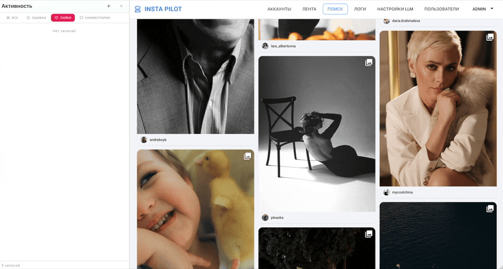

<div align="center">

# 🔄 Real-time через WebSocket


</div>

<br />

> Каждое действие на сервере (запрос ленты, лайк, комментарий, ошибка)
> мгновенно появляется в боковой панели UI **без перезагрузки страницы**.
> Под капотом — нативный `Laravel Reverb`, без Pusher и Soketi.

<br />

<div align="center">



</div>

---

## 🎯 Зачем это нужно

В админке десятки операций в секунду: лайки, переходы по аккаунтам, ошибки авторизации,
запросы в Instagram. Без real-time канала пользователь:

- 🔴 не видит, что система реально делает
- 🔴 вынужден обновлять страницу, чтобы увидеть свежие записи
- 🔴 не может отлавливать ошибки в момент их возникновения

**Решение** — sidebar, в который события прилетают **в момент создания записи** в БД.

---

## 🧩 Поток данных

```
┌──────────────┐                                          ┌──────────────┐
│  Controller  │                                          │  Vue (Echo)  │
└──────┬───────┘                                          └──────▲───────┘
       │ ① save log to DB                                        │ ⑤ обновляем
       ▼                                                         │   sidebarStore
┌──────────────┐    ② ShouldBroadcastNow                  ┌──────┴───────┐
│ ActivityLog- │ ───── event dispatched ─────────────────►│  pusher-js   │
│ Repository   │                                          └──────▲───────┘
└──────────────┘                                                 │
       │ ③ event() helper                                        │ ④ payload
       ▼                                                         │
┌──────────────┐                                          ┌──────┴───────┐
│ ActivityLog- │ ────► broadcast(payload, channel) ──────►│  Reverb WS   │
│ Created      │       on private:activity-log            │   (:8080)    │
└──────────────┘                                          └──────────────┘
```

**Этапы:**

1. Контроллер записывает действие в БД через `ActivityLoggerService`
2. Сервис создаёт событие `ActivityLogCreated` с интерфейсом `ShouldBroadcastNow`
3. Laravel сериализует payload и отправляет в Reverb (синхронно, без очереди)
4. Reverb рассылает payload всем авторизованным подписчикам канала `private:activity-log`
5. На фронте `Laravel Echo` принимает payload через `pusher-js`-транспорт
   и пушит запись в `sidebarActivityStore` (Pinia)

---

## 🔐 Авторизация private-канала

Канал `private:activity-log` защищён — анонимный клиент к нему не подпишется.
При попытке подписки `pusher-js` делает POST на `/broadcasting/auth` с Sanctum-токеном:

```php
// routes/channels.php
Broadcast::channel('activity-log', function (User $user) {
    return $user->hasRole('admin') || $user->hasRole('user');
});
```

Если `Closure` возвращает `true` — Laravel выдаёт подписку, иначе 403.

---

## 📁 Ключевые файлы

### Backend

| Файл                                                                                  | Что делает                                          |
| ------------------------------------------------------------------------------------- | --------------------------------------------------- |
| [`app/Events/ActivityLogCreated.php`](../backend-laravel/app/Events/ActivityLogCreated.php) | Broadcast-событие, сериализует лог в WS-payload     |
| [`app/Services/ActivityLoggerService.php`](../backend-laravel/app/Services/ActivityLoggerService.php) | Сохраняет лог в БД и диспатчит событие              |
| [`routes/channels.php`](../backend-laravel/routes/channels.php)                       | Авторизация подписок на private-каналы              |
| [`docker-compose.yml`](../docker-compose.yml)                                         | Сервис `reverb` на `:8080`                          |

### Frontend

| Файл                                                                                                                     | Что делает                              |
| ------------------------------------------------------------------------------------------------------------------------ | --------------------------------------- |
| [`shared/lib/echo.ts`](../frontend-vue/src/shared/lib/echo.ts)                                                           | Singleton `Echo`-клиент                 |
| [`entities/activity-log/model/sidebarActivityStore.ts`](../frontend-vue/src/entities/activity-log/model/sidebarActivityStore.ts) | Pinia-стор для сайдбара                 |
| [`entities/activity-log/model/sidebarActivityDTO.ts`](../frontend-vue/src/entities/activity-log/model/sidebarActivityDTO.ts) | snake_case → camelCase                  |
| [`features/activity-live/`](../frontend-vue/src/features/activity-live/)                                                | Подписка и обработка событий            |

---

## 💡 Почему именно так

| Решение                       | Альтернатива                | Почему именно это                                |
| ----------------------------- | --------------------------- | ------------------------------------------------ |
| **Reverb**                    | Pusher (платный SaaS)       | Бесплатно, локально, нет внешних зависимостей    |
| **Reverb**                    | Soketi (deprecated в 2024)  | Нативный сервер от Laravel, поддерживается из коробки |
| **`ShouldBroadcastNow`**      | `ShouldBroadcast` (queued)  | Лог должен прилететь моментально, без воркера    |
| **Echo + pusher-js**          | Чистый WebSocket API        | Авто-reconnect, retry, авторизация каналов       |
| **Private-канал**             | Public-канал                | Только авторизованные пользователи видят логи    |

---

## ⚙️ Минимальный пример

**Backend** — событие:

```php
final class ActivityLogCreated implements ShouldBroadcastNow
{
    public function __construct(public readonly AccountActivityLog $log) {}

    public function broadcastOn(): PrivateChannel
    {
        return new PrivateChannel('activity-log');
    }
}
```

**Frontend** — подписка:

```ts
echo.private('activity-log')
    .listen('ActivityLogCreated', (payload) => {
        sidebarStore.prepend(sidebarActivityDTO.toLocal(payload.log))
    })
```

---

<div align="center">

← [Вернуться к README](../README.md)

</div>
