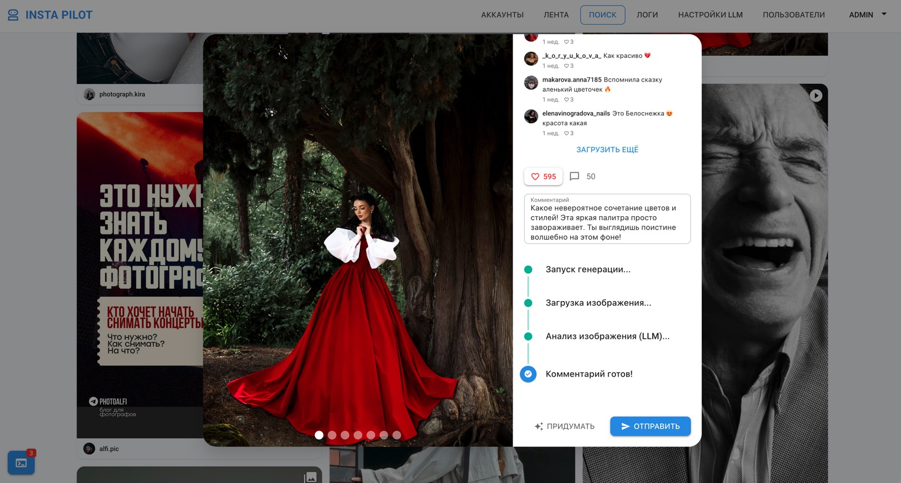

<div align="center">

# 🤖 Генерация комментариев через LLM


</div>

<br />

> Пользователь нажимает «Сгенерировать комментарий» — и видит **прогресс в реальном времени**:
> `starting → downloading → analyzing → completed`. Готовый текст автоматически вставляется в поле.
> Сценарий объединяет очереди, фоновые задачи, внешний LLM API и WebSocket-прогресс.

<br />

<div align="center">



</div>

---

## 🎯 Зачем это нужно

LLM-запрос с картинкой может занять 5–20 секунд. Если просто «крутить спиннер»:

🔴 пользователь не понимает, на каком этапе застряло
🔴 при ошибке непонятно, повторять ли запрос
🔴 нельзя показать промежуточные данные (например, что картинка уже скачана)

**Решение** — каждый шаг Job-а публикует событие через Reverb, фронт ловит его
state-машиной и отрисовывает прогресс.

---

## 🧩 Полный async flow

```
┌─────────────┐   POST /generate    ┌─────────────┐
│  Vue (UI)   │ ──────────────────► │  Controller │
└──────┬──────┘   { jobId } ◄────── └──────┬──────┘
       │                                   │ ① dispatch Job
       │ ② subscribe to                    ▼
       │   private:comment-          ┌─────────────┐
       │   generation.{jobId}        │ Redis Queue │
       │                             └──────┬──────┘
       │                                    │ ③ pop
       ▼                                    ▼
┌─────────────┐   ⑥ progress       ┌─────────────┐
│ State       │ ◄─────────────────  │ Queue Worker│
│ Machine     │   events            │ + GenerateJob│
└─────────────┘                     └──────┬──────┘
       ▲                                   │ ④ download img
       │                                   │ ⑤ call LLM
       │                                   ▼
┌─────────────┐                     ┌─────────────┐
│   Reverb    │ ◄─────── broadcast  │  LlmService │
│  WS server  │     CommentProgress │  (GLM/GPT)  │
└─────────────┘                     └─────────────┘
```

**Стадии:**

| # | Событие     | Что происходит                                      |
| - | ----------- | --------------------------------------------------- |
| 1 | `starting`  | Job стартовал, Reverb пушит первый payload          |
| 2 | `downloading` | Скачиваем картинку поста                          |
| 3 | `analyzing` | Отправили запрос в LLM, ждём ответ                  |
| 4 | `completed` | Получили текст, фронт автоматически вставляет в поле |
| 5 | `failed`    | Ошибка — фронт показывает retry, не «вечный спиннер» |

---

## 📁 Ключевые файлы

### Backend

| Файл                                                                                                       | Что делает                                  |
| ---------------------------------------------------------------------------------------------------------- | ------------------------------------------- |
| [`app/Jobs/GenerateCommentJob.php`](../backend-laravel/app/Jobs/GenerateCommentJob.php)                    | Точка входа, оркестрирует весь pipeline     |
| [`app/Services/LlmService.php`](../backend-laravel/app/Services/LlmService.php)                            | Отправка в OpenAI / GLM, нормализация ответов |
| [`app/Events/CommentGenerationProgress.php`](../backend-laravel/app/Events/CommentGenerationProgress.php)  | Broadcast-событие прогресса                 |
| [`routes/channels.php`](../backend-laravel/routes/channels.php)                                            | Авторизация private-канала по `jobId`        |

### Frontend

| Файл                                                                                                                         | Что делает                                |
| ---------------------------------------------------------------------------------------------------------------------------- | ----------------------------------------- |
| [`features/generate-comment/lib/useCommentGeneration.ts`](../frontend-vue/src/features/generate-comment/lib/useCommentGeneration.ts) | State-машина прогресса                    |
| [`features/generate-comment/ui/GenerationStatus.vue`](../frontend-vue/src/features/generate-comment/ui/GenerationStatus.vue)         | Отображение текущего шага                 |
| [`shared/lib/echo.ts`](../frontend-vue/src/shared/lib/echo.ts)                                                               | Подписка на канал по `jobId`              |

---

## 🔄 State-машина на фронте

Композабл `useCommentGeneration` — это конечный автомат, где каждое WebSocket-событие
переводит UI в новое состояние:

```ts
type GenerationStatus =
    | 'idle'
    | 'starting'
    | 'downloading'
    | 'analyzing'
    | 'completed'
    | 'failed'
```

Переходы:
```
idle → starting → downloading → analyzing → completed
                                          ↘ failed
```

При `completed` или `failed` — соединение автоматически закрывается, экономя ресурсы.

---

## 💡 Почему именно так

| Решение                              | Альтернатива                  | Почему именно это                                          |
| ------------------------------------ | ----------------------------- | ---------------------------------------------------------- |
| **Job + Queue**                      | Синхронный HTTP-запрос        | LLM может отвечать долго, нельзя блокировать PHP-FPM       |
| **WebSocket-прогресс**               | Polling каждые 500 мс         | Меньше нагрузки на сервер, мгновенная реакция UI           |
| **Канал по `jobId`**                 | Один общий канал              | Каждый клиент слушает только свою генерацию                |
| **State-машина**                     | Набор разрозненных `if`-ов    | Невалидные переходы невозможны на уровне типов              |
| **2 провайдера (GLM/OpenAI)**        | Только один                   | Можно переключиться через `LlmSettings` без релиза         |
| **`use_caption` опция**              | Всегда передавать caption     | Часть постов без описания — экономим токены                 |

---

## ⚙️ Минимальный пример

**Backend** — Job публикует прогресс:

```php
public function handle(LlmServiceInterface $llm): void
{
    event(new CommentGenerationProgress($this->jobId, 'starting'));

    $imageData = $this->downloadImage();
    event(new CommentGenerationProgress($this->jobId, 'downloading'));

    $comment = $llm->generate($imageData, $this->settings);
    event(new CommentGenerationProgress($this->jobId, 'completed', $comment));
}
```

**Frontend** — state-машина слушает и обновляется:

```ts
const status = ref<GenerationStatus>('idle')
const result = ref<string>('')

echo.private(`comment-generation.${jobId}`)
    .listen('CommentGenerationProgress', ({ stage, payload }) => {
        status.value = stage
        if (stage === 'completed') result.value = payload
    })
```

---

<div align="center">

← [Вернуться к README](../README.md)

</div>
